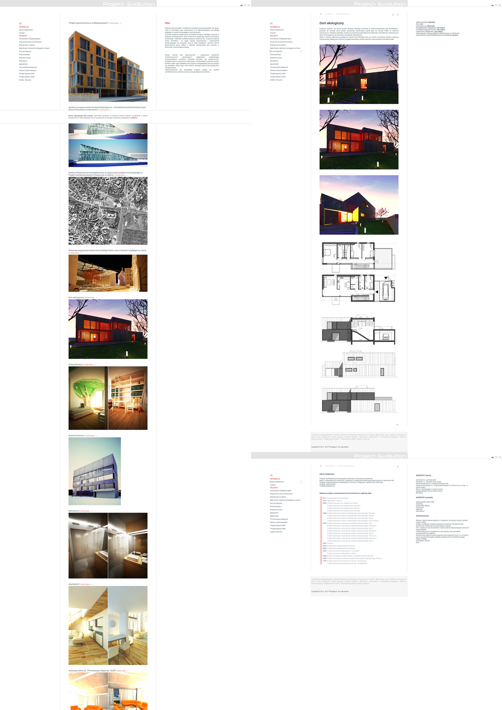

### Concept:
The concept was to base the page template on the harmonic division, the golden ratio. The golden portion.
- (a + b) / a = a / b ≡ φ
- φ = (1 + √5) / 2 = 1.618 ..
- https://en.wikipedia.org/wiki/Golden_ratio

### General info:
2016 | Architectural portfolio
	
### Technologies:
Project is created with:
* Html
* CSS

### Comments:
The content of the files was limited to the necessary elements (100).
